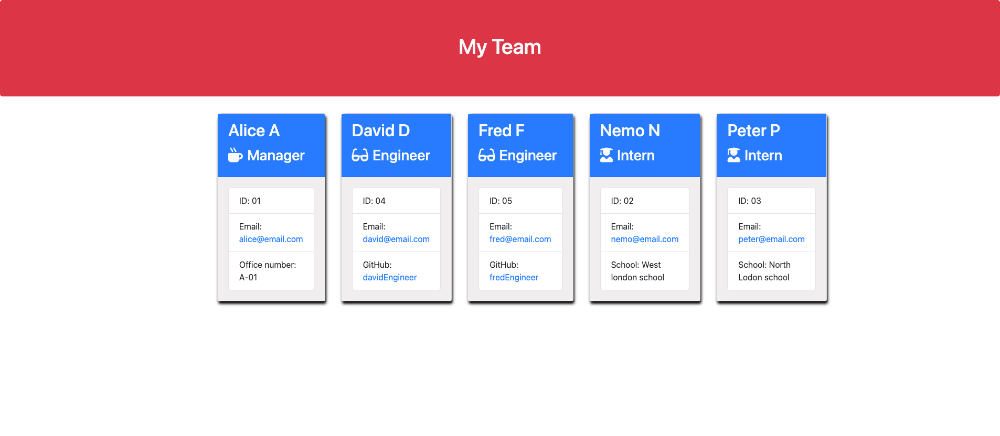

# MJ-Team-profile-generator

## Description

This application will take in information about employees on a software engineering team,  
then generates an HTML webpage that displays summaries for each person. 
Given tests are all passed to utilise TDD method.

## User Story

* As a manager, I want to generate a webpage that displays my team's basic info 
 so that a user have quick access to their emails and GitHub profiles.

## Table-Of-Contents
  * [Description](#description)
  * [Usage](#usage)
  * [Installation](#installation)
  * [Demonstration](#demonstration)
  * [Contact](#contact)

  ### Usage
  Type node index.js to start the application. Type npm run test to see tests are all passed.
  Then, questions will appear.  
  According to a manager's answers, team.html file will be created inside the output directory.

  ### Installation
  1. Install npm init -y
  2. npm i inquirer@6.3.1
  3. npm i jest

  ### Demonstration
 [Link to demo](https://drive.google.com/file/d/19Sc7juF5HCdN2E_bzLfH6mA5DWGi_VYy/view) 
 

 ### Contact
 Please check below links for the further details: 

[GitHub](https://github.com/Salala1005/) 
<a href="mailto:jin.mijeong@gmail.com?">Email</a>